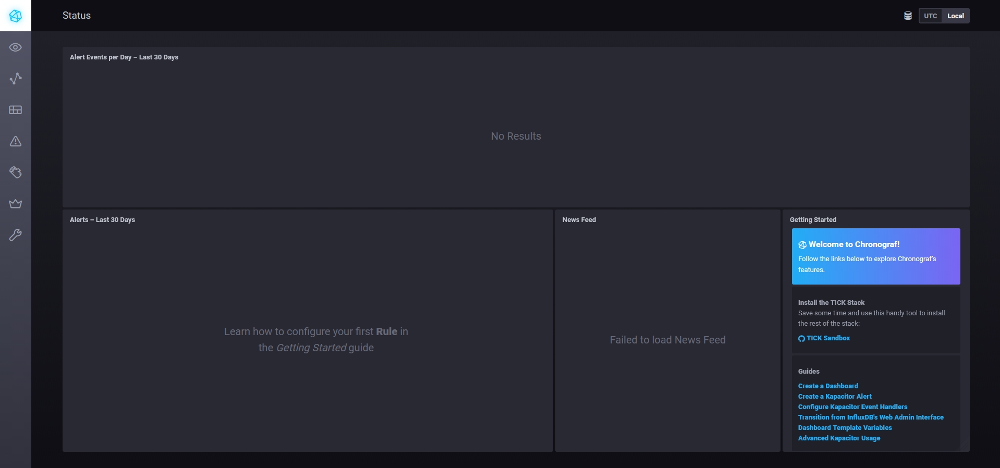
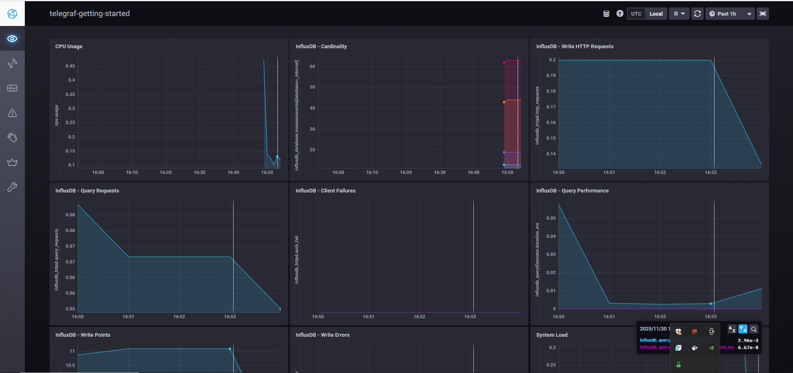
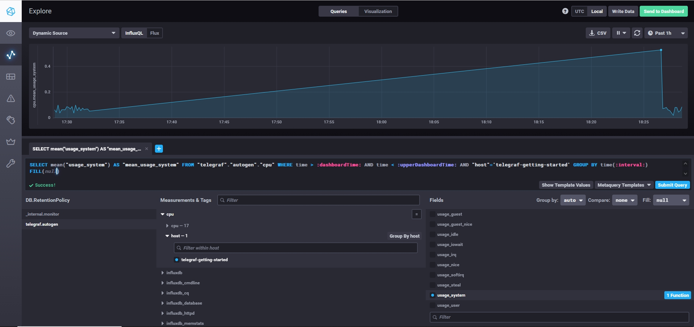
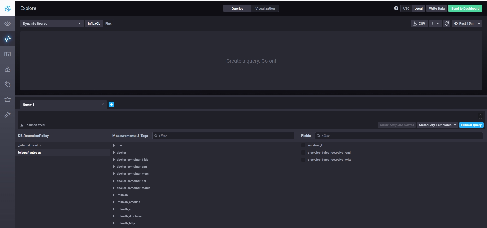

## Ответ на задание 1

### Минимальный набор метрик для мониторинга

---

## HTTP метрики

### **HTTP коды ответов (2xx/4xx/5xx)**

Используются для отслеживания успешности обработки запросов и выявления проблем на стороне сервера или клиента.

### **Response Time (время отклика)**

Показывает скорость работы системы с точки зрения пользователя, критично для понимания производительности.

### **RPS (requests per second)**

Помогает понять текущую нагрузку на систему и выявить аномалии в трафике.

---

## Ресурсы сервера

### **CPU usage**

Контроль загрузки процессора, необходимый для предотвращения перегрузки.

### **CPU Load Average**

Показывает среднюю нагрузку на систему и помогает выявлять проблемы с обработкой процессов.

### **RAM usage**

Нужен для контроля потребления оперативной памяти, чтобы избежать использования swap и падения производительности.

---

## Дисковые метрики

### **Disk space (свободное место)**

Важно контролировать, чтобы место на диске не закончилось, так как отчёты сохраняются на диск.

### **Disk I/O**

Контроль скорости операций чтения/записи; перегрузка диска может замедлить систему.

### **Inodes**

Могут закончиться при большом количестве файлов, даже если свободное место на диске ещё есть.

---

## Доступность

### **Service availability (uptime)**

Базовая проверка доступности сервиса для быстрого обнаружения полного отказа системы.

## Ответ на задание 2

### Что предложить менеджеру продукта

Менеджеру нужны не технические метрики (RAM/CPU/Inodes), а бизнес-метрики, которые отражают выполнение обязательств перед клиентами и качество обслуживания.

Ниже приведён предлагаемый набор метрик в формате SLA/SLO:

---

## 1. Availability (Доступность системы)

**Что показывает:**  
Процент времени, когда система доступна для клиентов.

**Формула:**  
`(успешные запросы / все запросы) × 100%`

**Пример SLA:**  
_Система доступна 99.9% времени в месяц._

---

## 2. Latency (Скорость ответа)

**Что показывает:**  
Насколько быстро клиенты получают результаты вычислений.

**Особенности:**  
Используются персентили **P95/P99**, а не среднее время.

**Пример SLA:**  
_95% запросов обрабатываются быстрее 2 секунд._

---

## 3. Error Rate (Процент ошибок)

**Что показывает:**  
Долю запросов, завершающихся ошибками по вине системы (5xx).

**Формула:**  
`(5xx ошибки / все запросы) × 100%`

**Пример SLA:**  
_Менее 0.1% запросов завершаются ошибкой._

---

## 4. Success Rate (Успешность вычислений)

**Что показывает:**  
Процент успешно завершённых вычислений и сохранённых отчётов.  
Особенно важно для платформ, где конечный результат — это файл на диске.

**Пример SLA:**  
_99.5% вычислений завершаются успешно._

---

## 5. Throughput (Пропускная способность)

**Что показывает:**  
Количество запросов, которое система способна обработать в единицу времени.  
Метрика важна для понимания масштабируемости и нагрузки.

**Пример:**  
_Система обрабатывает 1000 запросов в секунду._

---

Эти метрики понятны бизнесу и напрямую отражают удовлетворённость клиентов, а также выполнение договорных обязательств.

## Ответ на задание 3

### Решение проблемы сбора ошибок без бюджета на систему логирования

Ниже приведены несколько вариантов, которые позволяют разработчикам получать информацию об ошибках приложений без затрат на полноценную систему логирования.

---

## 1. Sentry (self-hosted версия)

**Описание:**  
Оптимальное решение для отслеживания ошибок приложений.  
Sentry можно развернуть на собственных серверах бесплатно, используя Docker Compose.

**Преимущества:**

- Автоматическая отправка исключений через SDK
- Полный stack trace и контекст выполнения
- Группировка одинаковых ошибок
- Уведомления о новых инцидентах

**Что даёт:**  
Детальную информацию об ошибках в удобном интерфейсе без финансовых затрат.

---

## 2. Использование Telegraf для парсинга логов

**Описание:**  
Так как уже используется TICK-стек, можно настроить Telegraf на чтение логов приложений.

**Механизм работы:**

- Чтение лог-файлов
- Фильтрация строк по ключевым словам: `ERROR`, `FATAL`, `Exception`
- Преобразование событий в метрики
- Отправка в InfluxDB

**Что даёт:**  
Позволяет отслеживать частоту ошибок, динамику и настраивать алерты.  
_Не предоставляет содержание самих логов, но обеспечивает полезную аналитическую сводку._

---

## 3. Простые скрипты с уведомлениями

**Описание:**  
Для критичных ошибок можно использовать bash-скрипты для парсинга логов.

**Принцип работы:**

- `grep` ищет ошибки в логах
- Результаты отправляются в Slack или Telegram
- Запуск через cron каждую минуту

**Что даёт:**  
Простое и быстрое решение для оперативного уведомления о проблемах.  
_Нет истории событий и расширенной аналитики._

---

## 4. Бесплатные SaaS сервисы

**Описание:**  
Можно использовать бесплатные тарифы облачных лог-сервисов.

**Примеры бесплатных планов:**

- Papertrail
- Loggly
- Better Stack

**Что даёт:**  
Подходит для систем с небольшим объёмом логов.  
Даёт веб-интерфейс, фильтрацию, хранение и поиск по логам.

---

## Ответ на задание 4

Где ошибка в расчете SLA Ошибка в формуле - не учтены **3xx коды ответа (редиректы)**. В системе отсутствуют 4xx и 5xx ошибки, но присутствуют 3xx редиректы, которые составляют около 30% от всех запросов. Редиректы это не ошибки, а нормальное поведение системы (например при переезде на HTTPS, изменении структуры URL, работе балансировщика или авторизации).

**Текущая формула (неправильная):**
SLA = summ_2xx_requests / summ_all_requests

**Правильная формула:**
SLA = (summ_2xx_requests + summ_3xx_requests) / summ_all_requests

**Или можно использовать обратный подсчет:**
SLA = (summ_all_requests - summ_5xx_requests) / summ_all_requests

При решении вопроса учета 4xx кодов в SLA нужно исходить из договоренностей с клиентами - считать ли клиентские ошибки нарушением обязательств или нет.

---

## Ответ на задание 5

### Основные плюсы и минусы pull и push систем мониторинга

**Push модель** - агенты на серверах активно отправляют метрики в систему мониторинга.

**Pull модель** - система мониторинга сама опрашивает серверы и забирает метрики.

---

### Push модель

**Плюсы:**

- Легко работает за NAT и firewall, так как серверы сами инициируют исходящие соединения
- Не нужно открывать порты на серверах для входящих подключений
- Подходит для короткоживущих задач и batch jobs, которые могут отправить метрики перед завершением
- Гибкость в отправке данных - можно слать метрики когда это необходимо

**Минусы:**

- Сложно обнаружить падение сервера - отсутствие данных можно спутать с сетевой задержкой
- Спайки нагрузки на коллектор, когда множество серверов отправляют данные одновременно
- Настройка интервалов отправки требует изменения конфигурации на каждом сервере
- Риск получения фейковых метрик если нет надежной аутентификации
- Коллектор не знает о новых серверах автоматически
- Сложнее масштабировать и отлаживать

---

### Pull модель

**Плюсы:**

- Легко обнаружить недоступность сервера - если опрос не удался, значит проблема
- Равномерная и контролируемая нагрузка на коллектор
- Централизованная настройка интервалов сбора метрик в одном месте
- Поддержка Service Discovery для автоматического обнаружения новых серверов
- Проще отлаживать - всегда понятно откуда берутся данные
- Контроль над тем какие серверы опрашивать

**Минусы:**

- Не работает за NAT без дополнительных настроек (проброс портов, VPN)
- Необходимо открывать порты на каждом сервере для входящих подключений
- Не подходит для короткоживущих задач, которые могут завершиться до опроса
- Может создавать много исходящих соединений при большом количестве серверов
- Метрики доступны всем кто может достучаться до открытого порта

---

## Ответ на задание 6

### Классификация систем мониторинга по модели сбора данных

Ниже приведена классификация наиболее распространённых систем мониторинга в зависимости от способа получения метрик.

---

## Pull-модель

### **Prometheus**

- Использует нативную pull-модель: система сама скрейпит метрики с endpoints.
- Для короткоживущих задач применяется **Pushgateway**.

### **Nagios**

- Классическая pull-система: активно опрашивает хосты и сервисы по расписанию.
- Имеет NSCA для пассивных проверок, но это _не основной режим работы_.

---

## Push-модель

### **TICK (Telegraf + InfluxDB + Chronograf + Kapacitor)**

- Агент **Telegraf** собирает метрики и **отправляет** их в InfluxDB.
- InfluxDB работает в пассивном режиме — просто принимает данные.

---

## Гибридные системы

### **Zabbix**

- Полноценная поддержка обеих моделей.
- **Passive checks (pull):** сервер опрашивает агенты.
- **Active checks (push):** агенты сами отправляют данные на сервер.

### **VictoriaMetrics**

- Совместима с Prometheus и поддерживает pull-скрейпинг.
- Одновременно поддерживает множество push-протоколов (InfluxDB, Graphite, OpenTSDB, DataDog) через HTTP API.

---

## Ответ на задание 7

---

## Ответ на задание 8

---

## Ответ на задание 9

---
